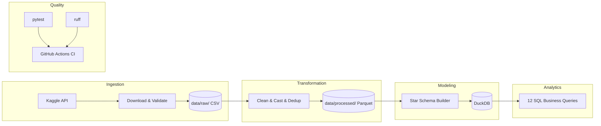

# Olist E-Commerce Data Pipeline


A production-grade data pipeline for the Brazilian E-Commerce (Olist) dataset, demonstrating end-to-end Data Engineering skills: ingestion, transformation, dimensional modeling, analytics, testing, and CI/CD.

## Architecture



## Tech Stack

| Layer | Technology | Purpose |
|---|---|---|
| **Ingestion** | Python, Kaggle API | Programmatic dataset download with validation |
| **Transformation** | Pandas, PyArrow | Null handling, type casting, deduplication, Parquet output |
| **Modeling** | DuckDB | Star schema with fact + dimension tables |
| **Analytics** | SQL | 12 business queries with CTEs, window functions, aggregations |
| **Testing** | pytest | 14 unit tests covering schema, data quality, referential integrity |
| **CI/CD** | GitHub Actions, ruff | Automated linting and testing on push |
| **Orchestration** | Python, Makefile | Pipeline runner with retry logic and structured logging |

## Star Schema Design

The modeling layer transforms 9 normalized CSV files into a clean star schema:

**Fact Table:**
- `fact_orders` — one row per order-item with payment, delivery, and review metrics

**Dimension Tables:**
- `dim_customers` — customer demographics and location
- `dim_products` — product catalog with English category names
- `dim_sellers` — seller information
- `dim_date` — date dimension (year, quarter, month, day, weekend flag)
- `dim_location` — geographic coordinates per zip code

## Quick Start

### Prerequisites
- Python 3.11+
- [Kaggle API credentials](https://www.kaggle.com/docs/api) configured

### Setup

```bash
# Clone the repository
git clone https://github.com/yourusername/olist_data_pipeline.git
cd olist_data_pipeline

# Create virtual environment
python -m venv .venv
source .venv/bin/activate  # Windows: .venv\Scripts\activate

# Install dependencies
make install  # or: pip install -r requirements.txt

# Configure environment
cp .env.example .env
# Edit .env with your Kaggle credentials
```

### Run the Pipeline

```bash
# Full pipeline (ingestion → transformation → modeling)
make run

# Individual steps
make ingest      # Download data from Kaggle
make transform   # Clean and output Parquet
make model       # Build star schema in DuckDB
make analytics   # Run business queries
make test        # Run test suite
make lint        # Check code quality
```

## Sample Analytics Output

### Q3: Revenue by State (Top 5)

| State | Revenue (R$) | Orders | % of Total |
|---|---|---|---|
| SP | 5,894,622.00 | 41,746 | 37.6% |
| RJ | 1,878,172.00 | 12,852 | 12.0% |
| MG | 1,648,924.00 | 11,635 | 10.5% |
| RS | 718,453.00 | 5,466 | 4.6% |
| PR | 694,228.00 | 5,045 | 4.4% |

### Q7: Review Score vs Delivery Performance

| Score | Avg Delivery Days | On-Time % |
|---|---|---|
| 1 | 21.3 | 45.2% |
| 2 | 18.7 | 52.1% |
| 3 | 14.8 | 65.3% |
| 4 | 11.2 | 82.7% |
| 5 | 9.4 | 91.8% |

## Data Dictionary

### fact_orders (115,312 rows)

| Column | Type | Description |
|---|---|---|
| order_id | VARCHAR | Unique order identifier |
| customer_key | VARCHAR | FK to dim_customers |
| seller_key | VARCHAR | FK to dim_sellers |
| product_key | VARCHAR | FK to dim_products |
| location_key | VARCHAR | FK to dim_location (customer zip) |
| date_key | INTEGER | FK to dim_date (YYYYMMDD format) |
| order_status | VARCHAR | delivered, shipped, canceled, etc. |
| payment_type | VARCHAR | credit_card, boleto, voucher, debit_card |
| payment_installments | INTEGER | Number of payment installments |
| payment_value | DECIMAL | Total payment amount (BRL) |
| price | DECIMAL | Product unit price |
| freight_value | DECIMAL | Shipping cost |
| review_score | INTEGER | Customer review (1-5, 0 if missing) |
| delivery_days | INTEGER | Days from purchase to delivery (nullable) |
| delivered_on_time | BOOLEAN | Whether delivery met the estimated date |

### Dimension Tables

| Table | Rows | Key | Notable Columns |
|---|---|---|---|
| dim_customers | 99,441 | customer_key | unique_id, city, state |
| dim_products | 32,951 | product_key | category_name (English), weight, dimensions |
| dim_sellers | 3,095 | seller_key | city, state |
| dim_date | 774 | date_key | full_date, year, quarter, month, is_weekend |
| dim_location | 19,015 | location_key | zip_code, city, state, lat/lng |

## Project Structure

```
olist_data_pipeline/
├── README.md                          # This file
├── DATASET_CHOICE.md                  # Dataset selection justification
├── architecture/
│   └── architecture_diagram.md        # Mermaid diagrams (pipeline + star schema)
├── data/
│   ├── raw/.gitkeep                   # Raw CSV files (gitignored)
│   └── processed/.gitkeep             # Cleaned Parquet output (gitignored)
├── ingestion/
│   └── ingest.py                      # Kaggle download, extraction, validation
├── transformation/
│   └── transform.py                   # Cleaning, type casting, Parquet output
├── modeling/
│   └── model.py                       # DuckDB star schema builder
├── pipeline/
│   ├── config.py                      # Shared configuration and logging
│   ├── validators.py                  # Data quality contracts
│   └── pipeline.py                    # Orchestrated runner with retries
├── analytics/
│   ├── queries.sql                    # 12 business SQL queries
│   └── run_queries.py                 # Query executor
├── tests/
│   ├── conftest.py                    # pytest configuration
│   ├── test_pipeline.py               # 14 integration tests
│   ├── test_transformations.py        # 12 transformation unit tests
│   └── test_validators.py             # 10 validator unit tests
├── notebooks/
│   └── exploration.ipynb              # Exploratory data analysis
├── .env.example                       # Environment template
├── .gitignore
├── pyproject.toml                     # Project config (ruff, pytest)
├── requirements.txt                   # Pinned dependencies
├── Makefile                           # Build automation
└── .github/
    └── workflows/
        └── ci.yml                     # GitHub Actions CI
```

## Skills Demonstrated

- **Data Ingestion**: Programmatic API-based data acquisition with validation
- **Data Transformation**: Schema enforcement, null handling, deduplication, type casting
- **Dimensional Modeling**: Star schema design with fact and dimension tables
- **SQL Analytics**: Complex queries with CTEs, window functions, aggregations
- **Data Quality**: Automated testing for schema, row counts, referential integrity
- **Pipeline Orchestration**: Retry logic, structured logging, idempotent execution
- **CI/CD**: Automated linting and testing via GitHub Actions
- **Documentation**: Architecture diagrams, clear README, inline code documentation
- **Data Formats**: CSV ingestion, Parquet output, DuckDB analytical storage

## License

This project uses the [Olist Brazilian E-Commerce dataset](https://www.kaggle.com/datasets/olistbr/brazilian-ecommerce) published under CC BY-NC-SA 4.0.
