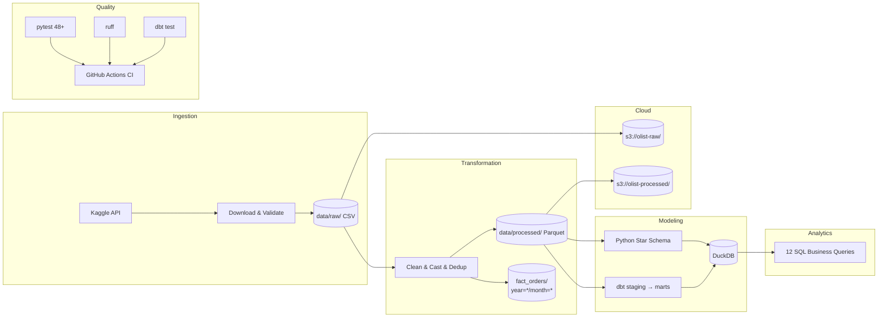
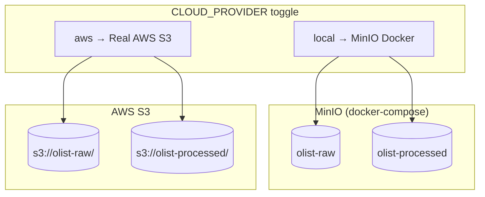
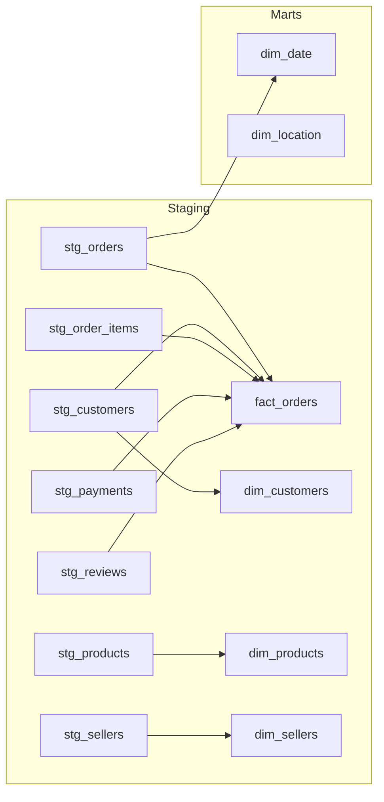

# Olist E-Commerce Data Pipeline


A production-grade data pipeline for the Brazilian E-Commerce (Olist) dataset, demonstrating end-to-end Data Engineering skills: ingestion, transformation, dimensional modeling, cloud storage, dbt, analytics, testing, and CI/CD.

## Architecture



## Tech Stack

| Layer | Technology | Purpose |
|---|---|---|
| **Ingestion** | Python, Kaggle API | Programmatic dataset download with validation |
| **Transformation** | Pandas, PyArrow | Null handling, type casting, deduplication, Parquet output |
| **Partitioning** | PyArrow write_to_dataset | Year/month partitioned Parquet for fact_orders |
| **Modeling (Python)** | DuckDB | Star schema with fact + dimension tables |
| **Modeling (dbt)** | dbt-core, dbt-duckdb | SQL-based staging → marts transformation layer |
| **Cloud Storage** | boto3, MinIO / AWS S3 | S3-compatible object storage with local simulation |
| **Analytics** | SQL | 12 business queries with CTEs, window functions, aggregations |
| **Testing** | pytest, dbt test | 48+ tests covering schema, data quality, cloud, partitioning |
| **CI/CD** | GitHub Actions, ruff | Automated linting and testing on push |
| **Orchestration** | Python, Makefile | Pipeline runner with retry logic and structured logging |
| **Infrastructure** | Docker Compose | Local MinIO container for cloud layer |

## Star Schema Design

The modeling layer transforms 9 normalized CSV files into a clean star schema:

**Fact Table:**
- `fact_orders` — one row per order-item with payment, delivery, and review metrics

**Dimension Tables:**
- `dim_customers` — customer demographics and location
- `dim_products` — product catalog with English category names
- `dim_sellers` — seller information
- `dim_date` — date dimension (year, quarter, month, day, weekend flag)
- `dim_location` — geographic coordinates per zip code

## Cloud Architecture

The pipeline includes an S3-compatible storage layer that works both locally and in production:



- **Local mode** (default): `docker compose up -d` starts MinIO, accessible at `localhost:9000`
- **AWS mode**: Set `CLOUD_PROVIDER=aws` in `.env` with real AWS credentials
- Upload with: `make upload-raw` and `make upload-processed`

## dbt Layer

The project has a **dual-layer modeling approach**:

1. **Python pipeline** (`transformation/` + `modeling/`) — original ETL with Pandas and DuckDB
2. **dbt models** (`dbt/olist_dbt/`) — SQL-based transformation following dbt best practices



Run with: `make dbt-run` and `make dbt-test`

## Partitioning Strategy

The `fact_orders` Parquet output is **partitioned by year and month** using PyArrow's `write_to_dataset`:

```
data/processed/fact_orders/
├── year=2016/
│   ├── month=9/   → *.parquet
│   ├── month=10/  → *.parquet
│   └── month=12/  → *.parquet
├── year=2017/
│   ├── month=1/   → *.parquet
│   ├── ...
│   └── month=12/  → *.parquet
└── year=2018/
    ├── month=1/   → *.parquet
    ├── ...
    └── month=9/   → *.parquet
```

**Why partition?** In production, partitioned Parquet enables query engines (Spark, Athena, BigQuery) to skip irrelevant partitions — dramatically reducing scan time for time-filtered queries. DuckDB reads the partitioned layout via `read_parquet('fact_orders/**/*.parquet')`.

## Quick Start

### Prerequisites
- Python 3.11+
- [Kaggle API credentials](https://www.kaggle.com/docs/api) configured
- Docker (optional, for cloud storage layer)

### Setup

```bash
# Clone the repository
git clone https://github.com/AugustoTonelli14/olist_data_pipeline.git
cd olist_data_pipeline

# Create virtual environment
python -m venv .venv
source .venv/bin/activate  # Windows: .venv\Scripts\activate

# Install dependencies
make install  # or: pip install -r requirements.txt

# Configure environment
cp .env.example .env
# Edit .env with your Kaggle credentials
```

### Run the Pipeline

```bash
# Full pipeline (ingestion → transformation → modeling)
make run

# Individual steps
make ingest            # Download data from Kaggle
make transform         # Clean and output Parquet (+ partitioned fact)
make model             # Build star schema in DuckDB
make analytics         # Run business queries
make test              # Run pytest suite
make lint              # Check code quality

# Cloud storage
make storage-up        # Start MinIO container
make upload-raw        # Upload CSVs to S3
make upload-processed  # Upload Parquets to S3

# dbt
make dbt-run           # Run dbt models
make dbt-test          # Run dbt schema tests
make dbt-docs          # Generate dbt documentation site
```

## Sample Analytics Output

### Q3: Revenue by State (Top 5)

| State | Revenue (R$) | Orders | % of Total |
|---|---|---|---|
| SP | 5,894,622.00 | 41,746 | 37.6% |
| RJ | 1,878,172.00 | 12,852 | 12.0% |
| MG | 1,648,924.00 | 11,635 | 10.5% |
| RS | 718,453.00 | 5,466 | 4.6% |
| PR | 694,228.00 | 5,045 | 4.4% |

### Q7: Review Score vs Delivery Performance

| Score | Avg Delivery Days | On-Time % |
|---|---|---|
| 1 | 21.3 | 45.2% |
| 2 | 18.7 | 52.1% |
| 3 | 14.8 | 65.3% |
| 4 | 11.2 | 82.7% |
| 5 | 9.4 | 91.8% |

## Data Dictionary

### fact_orders (115,312 rows)

| Column | Type | Description |
|---|---|---|
| order_id | VARCHAR | Unique order identifier |
| customer_key | VARCHAR | FK to dim_customers |
| seller_key | VARCHAR | FK to dim_sellers |
| product_key | VARCHAR | FK to dim_products |
| location_key | VARCHAR | FK to dim_location (customer zip) |
| date_key | INTEGER | FK to dim_date (YYYYMMDD format) |
| order_status | VARCHAR | delivered, shipped, canceled, etc. |
| payment_type | VARCHAR | credit_card, boleto, voucher, debit_card |
| payment_installments | INTEGER | Number of payment installments |
| payment_value | DECIMAL | Total payment amount (BRL) |
| price | DECIMAL | Product unit price |
| freight_value | DECIMAL | Shipping cost |
| review_score | INTEGER | Customer review (1-5, 0 if missing) |
| delivery_days | INTEGER | Days from purchase to delivery (nullable) |
| delivered_on_time | BOOLEAN | Whether delivery met the estimated date |

### Dimension Tables

| Table | Rows | Key | Notable Columns |
|---|---|---|---|
| dim_customers | 99,441 | customer_key | unique_id, city, state |
| dim_products | 32,951 | product_key | category_name (English), weight, dimensions |
| dim_sellers | 3,095 | seller_key | city, state |
| dim_date | 774 | date_key | full_date, year, quarter, month, is_weekend |
| dim_location | 19,015 | location_key | zip_code, city, state, lat/lng |

## Project Structure

```
olist_data_pipeline/
├── README.md
├── DATASET_CHOICE.md
├── docker-compose.yml                 # MinIO local S3
├── architecture/
│   └── architecture_diagram.md        # Mermaid diagrams (4 diagrams)
├── data/
│   ├── raw/.gitkeep
│   └── processed/.gitkeep
├── ingestion/
│   └── ingest.py
├── transformation/
│   └── transform.py                   # + partitioned Parquet output
├── modeling/
│   └── model.py
├── storage/
│   └── cloud_storage.py               # S3/MinIO upload module
├── dbt/
│   └── olist_dbt/
│       ├── dbt_project.yml
│       ├── profiles.yml
│       └── models/
│           ├── staging/               # 7 staging models + schema.yml
│           └── marts/                 # 6 mart models + schema.yml
├── pipeline/
│   ├── config.py
│   ├── validators.py
│   └── pipeline.py
├── analytics/
│   ├── queries.sql                    # 12 business SQL queries
│   └── run_queries.py
├── tests/
│   ├── test_pipeline.py               # 14 integration tests
│   ├── test_transformations.py        # 13 transformation unit tests
│   ├── test_validators.py             # 10 validator unit tests
│   ├── test_cloud_storage.py          # 7 cloud storage unit tests
│   └── test_partitioning.py           # 4 partitioning tests
├── notebooks/
│   └── exploration.ipynb              # Full EDA (10 charts, 5 sections)
├── .env.example
├── .gitignore
├── pyproject.toml
├── requirements.txt
├── Makefile
└── .github/
    └── workflows/
        └── ci.yml
```

## Skills Demonstrated

- **Data Ingestion**: Programmatic API-based data acquisition with validation
- **Data Transformation**: Schema enforcement, null handling, deduplication, type casting
- **Parquet Partitioning**: Year/month partitioned output via PyArrow
- **Cloud Storage**: S3-compatible uploads with MinIO (local) / AWS (production) toggle
- **Dimensional Modeling**: Star schema design with fact and dimension tables
- **dbt**: SQL-based staging → marts transformation with schema tests
- **SQL Analytics**: Complex queries with CTEs, window functions, aggregations
- **Data Quality**: Automated testing for schema, row counts, referential integrity
- **Pipeline Orchestration**: Retry logic, structured logging, idempotent execution
- **CI/CD**: Automated linting and testing via GitHub Actions
- **Infrastructure as Code**: Docker Compose for local cloud simulation
- **Documentation**: Architecture diagrams, data dictionary, comprehensive README

## License

This project uses the [Olist Brazilian E-Commerce dataset](https://www.kaggle.com/datasets/olistbr/brazilian-ecommerce) published under CC BY-NC-SA 4.0.
