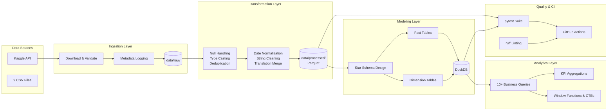
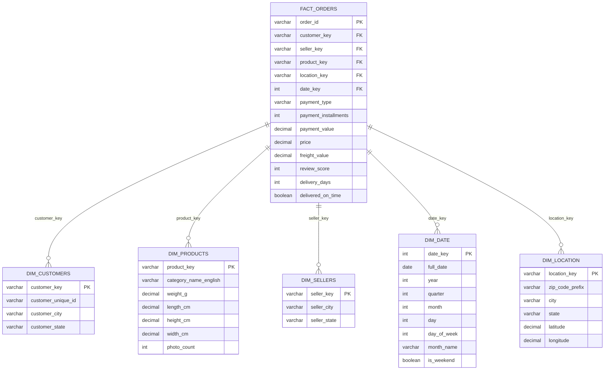

# Pipeline Architecture

## High-Level Data Flow

## Star Schema Design

## Technology Stack

| Layer | Technology | Purpose |
|---|---|---|
| Ingestion | Python + Kaggle API | Programmatic data download |
| Transformation | Pandas | Cleaning, type casting, enrichment |
| Storage (Raw) | CSV | Original format preservation |
| Storage (Processed) | Parquet | Columnar, compressed, partitioned |
| Modeling | DuckDB | Local analytical database |
| Analytics | SQL | Business intelligence queries |
| Testing | pytest | Pipeline validation |
| CI/CD | GitHub Actions | Automated testing and linting |
| Linting | ruff | Code quality enforcement |
| Orchestration | Python + Makefile | Pipeline execution |
