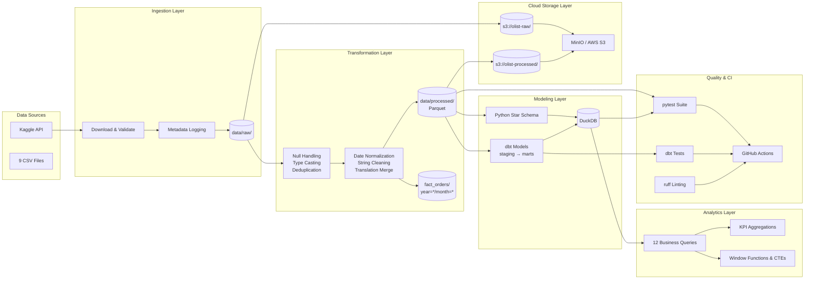
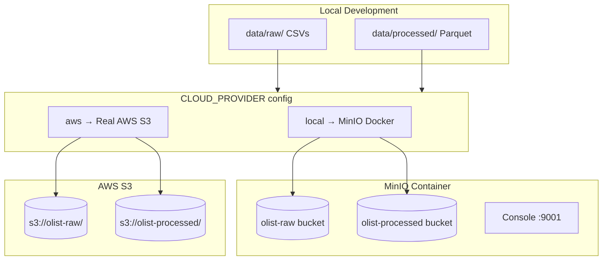
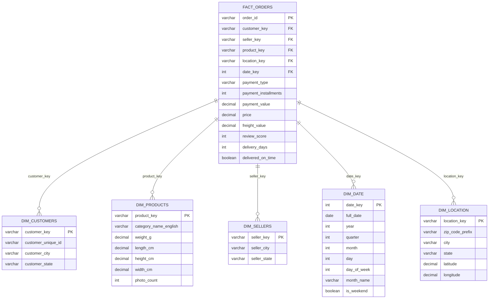
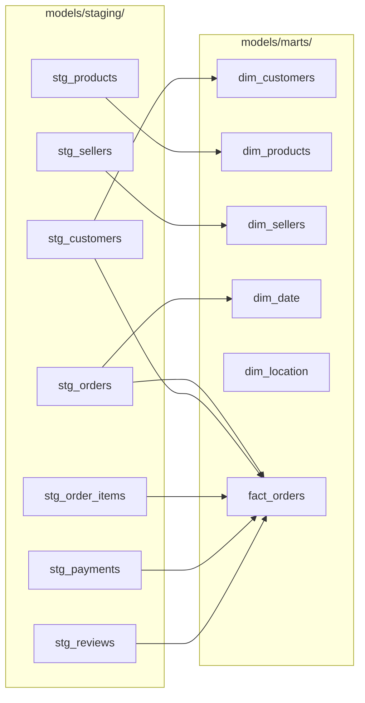

# Pipeline Architecture

## High-Level Data Flow

## Cloud Storage Architecture

## Star Schema Design

## dbt Model Lineage

## Technology Stack

| Layer | Technology | Purpose |
|---|---|---|
| Ingestion | Python + Kaggle API | Programmatic data download |
| Transformation | Pandas + PyArrow | Cleaning, type casting, enrichment |
| Partitioning | PyArrow write_to_dataset | Year/month partitioned Parquet |
| Storage (Raw) | CSV | Original format preservation |
| Storage (Processed) | Parquet | Columnar, compressed, partitioned |
| Cloud Storage | MinIO / AWS S3 + boto3 | S3-compatible object storage |
| Modeling (Python) | DuckDB | Local analytical database |
| Modeling (dbt) | dbt-core + dbt-duckdb | SQL-based staging → marts |
| Analytics | SQL | Business intelligence queries |
| Testing | pytest + dbt test | Pipeline and schema validation |
| CI/CD | GitHub Actions | Automated testing and linting |
| Linting | ruff | Code quality enforcement |
| Orchestration | Python + Makefile | Pipeline execution |
| Infrastructure | Docker Compose | Local MinIO for cloud simulation |
